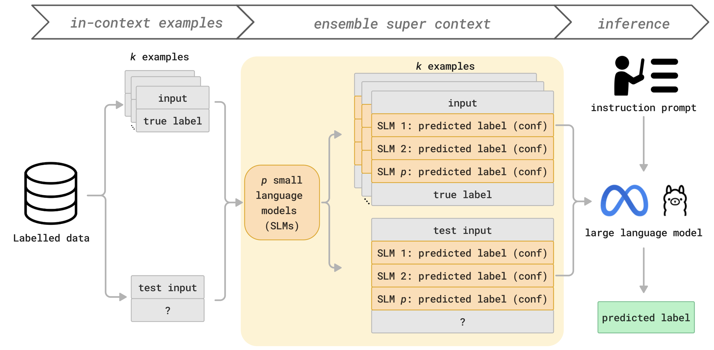

## Ensemble Super In-Context Learning
Code for [Improving In-Context Learning with Small Language Model Ensembles](url), presented at NeurIPS 2024 in the workshop on [Adaptive Foundation Models](https://adaptive-foundation-models.org/).



Ensemble SuperICL offers cheap and effective domain-specialisation in LLMs by combining the predictions and confidence scores of several small language models, outperforming baselines on a medical labelling task and NLP benchmarks.

## How to run code

Install requirements

```
pip install -r requirements.txt
```

To produce the small language model results on the four benchmark datasets (i.e. `sst2`, `mrpc`, `mnli-m`, `cola`) and the MedMCQA case study, run:

```
python3 main_benchmarks.py \
--run_plugins \
--dataset sst2
--plugins roberta-large-sst2 deberta-large-sst2 bart-large-sst2 electra-large-sst2 \ #replace dataset name according to --dataset

python3 main_medmcqa.py \
--run_plugins \
--plugins roberta-large-mnli deberta-large-mnli bart-large-mnli flan-t5-mnli electra-large-mnli
```

## Ensemble SuperICL experiments

### 1. Generate and store the small language model predictions for each dataset, for efficiency.

First ensure that you have this file structure in your repository for each dataset you're generating SLM data for:

```
-data
--plugin_data
---{args.dataset} # for example, 'sst2'
```

Then, run this to generate SLM data which will be saved to the {args.dataset} folder above:
```
python generate_slm_data_benchmarks.py \
--dataset sst2
--plugins roberta-large-sst2 deberta-large-sst2 bart-large-sst2 electra-large-sst2 \ #replace dataset name according to --dataset
--context_source train \ #in-context examples come from training set
--test_source validation \ #test examples come from validation set. Note that test set cannot be used since true labels are not publicly available.

python generate_slm_data_medmcqa.py
--plugins roberta-large-mnli deberta-large-mnli bart-large-mnli flan-t5-mnli electra-large-mnli
```

### 2. Produce Ensemble SuperICL results

```
python main_benchmarks.py \
--run_esupericl \
--llm llama3-8b-instruct \
--plugins roberta-large-sst2 deberta-large-sst2 bart-large-sst2 electra-large-sst2 \
--num_examples 16 \
--dataset sst2 \

python main_medmcqa.py \
--run_esupericl \
--llm llama3-8b-instruct \
--plugins roberta-large-mnli deberta-large-mnli bart-large-mnli flan-t5-mnli electra-large-mnli \
--num_examples 16
```
To reproduce the best performing model results as presented in Table 2, use the hyperparameters detailed in Table 9 in Appendix G.

## Citation
```bibtex
@article{mojarradi2024improving,
  title={Improving In-Context Learning with Small Language Model Ensembles},
  author={M. Mehdi Mojarradi and Lingyi Yang and Robert McCraith and Adam Mahdi},
  journal={Advances in Neural Information Processing Systems (NeurIPS): Workshop on Adaptive Foundation Models},
  volume={38}
  year={2024}
}
```
